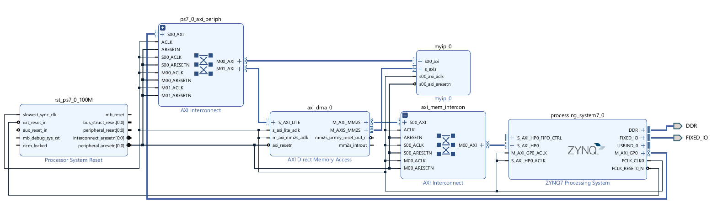
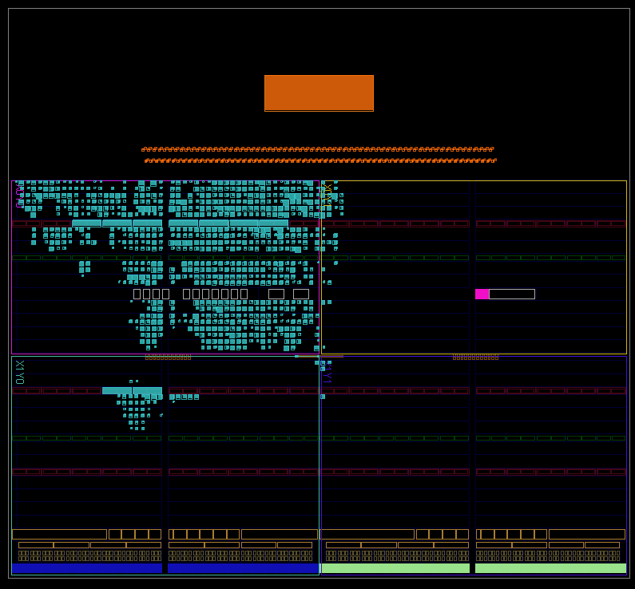

# FPGA FC-Layer Accelerator on Zynq: Diagnosing and Removing a Data-Movement Bottleneck

A fully connected (FC) layer MAC accelerator deployed on a Xilinx Zynq-7000 (Zybo Z7-10),
profiled on real hardware, and redesigned around AXI DMA after measurement showed that
**data loading — not computation — consumed roughly 98% of end-to-end time.**

**Result: loading time reduced 21.8x; within the measured benchmark scope, end-to-end
performance flipped from a 3.6x deficit to a 4.1x advantage over optimized software,
with bit-exact agreement against a golden reference in all reported hardware runs.**

---

## Attribution and Scope

The baseline design (4-core 8-bit MAC kernel, AXI4-Lite control/register file, BRAM data
mover) comes from a paid commercial FPGA lecture series. **Course files are not
redistributed in this repository, in keeping with the course's terms.**

This repository contains only my own contributions:

| Contribution | Where |
|---|---|
| AXI-Stream → BRAM receiver module (new RTL) | `rtl/axis_to_bram.v` |
| PIO/DMA path-select mux + control register design (modifications to course RTL, documented) | `docs/MODIFICATIONS.md` |
| DMA helper functions: transfer programming, cache-coherency handling, documented integration flow (new C code) | `sw/dma_extension.c` |
| System integration: AXI DMA IP, Zynq HP0 port, block-design integration, and interface routing | `docs/architecture.md` |
| On-board benchmarking, bottleneck profiling, verification | `results/` |
| Root-cause debugging of a silent DMA failure (length-register truncation) | `docs/debugging_story.md` |

---

## The Problem, Measured

The baseline loads two 4,096-word operand arrays into on-chip BRAM through AXI4-Lite
programmed I/O — 8,192 single-word transfers, each carrying full address/data/response
handshake overhead and CPU involvement.

Measured on hardware (PL @ 100 MHz, Cortex-A9 bare-metal, SW compiled `-O2`):

| Stage | PIO baseline | After DMA redesign |
|---|---|---|
| BRAM0 load (node) | 923.22 µs | **42.43 µs** |
| BRAM1 load (weight) | 922.83 µs | **42.42 µs** |
| Core compute (4-core MAC, 4,096 iter) | 41.67 µs | 41.69 µs |
| Result readback | 0.83 µs | 0.83 µs |
| **End-to-end** | **1,888.54 µs** | **127.37 µs** |

Timed region: transfer + compute + readback. Input generation and the one-time
cache flush run before the timed region, so "end-to-end" here means accelerator
execution time excluding input generation and cache maintenance.

Reference points:
- SW compute on the A9 (`-O2`): **519.26 µs** → pure-compute speedup of the PL core: ~12.5x (12.2x on the baseline bitstream session)
- Within the measured benchmark scope, vs. SW (-O2): PIO path **3.6x slower** → DMA path **4.1x faster**
- DMA load time: 4,096 words x 10 ns/clk = 40.96 µs ideal; 42.43 µs measured —
  within 3.6% of the ideal streaming time, consistent with near-one-word-per-cycle
  delivery after fixed setup overhead.
- Verification: SW golden reference vs. hardware results — **bit-exact match** in all
  reported hardware runs (menu-driven CHECK over all 4 accumulators).

Raw serial logs from the board are in `results/`.

## What Changed

````
Before (PIO):   DDR ──CPU, 8,192 single AXI-Lite writes──▶ BRAM ──▶ 4x MAC cores
After  (DMA):   DDR ──AXI DMA burst via Zynq HP0──▶ AXI-Stream ──▶ axis_to_bram ──▶ BRAM ──▶ 4x MAC cores
                       (CPU programs one MM2S transfer per array; cache flushed before transfer)
````

The implemented block design — control on GP0 (left interconnect), bulk data
from DDR through `S_AXI_HP0` (right interconnect), and the DMA's `M_AXIS_MM2S`
stream into the accelerator's `s_axis` port:



Design decisions worth noting:

- **The original PIO path was kept, selectable at runtime via a control register**
  (register slot 10 at byte offset 0x28: bit 0 selects PIO/DMA mode, bit 1 the
  target BRAM). This enabled
  like-for-like A/B measurement on the same bitstream and preserved a known-good
  path for regression during bring-up. It also localized fault isolation: when the
  DMA path first hung, the working PIO path showed the baseline accelerator and original
  control path were intact, narrowing the investigation to the newly added
  DMA path.
- **`axis_to_bram` generates what the stream lacks — addresses.** AXI-Stream carries
  data with valid/ready handshaking but no addressing; the receiver counts accepted
  beats (0,1,2,…) into a BRAM write address and resets on `TLAST`. `tready` is held
  high since BRAM accepts one write per cycle, so no backpressure logic is needed.
- **Cache coherency handled explicitly**: operand buffers are flushed
  (`Xil_DCacheFlushRange`) after generation so the DMA — which reads DDR, not the
  CPU cache — sees current data.

## The Bug That Taught the Most

The first DMA bring-up hung with **no error flags**: status register `0x00000000` —
not halted, not idle, no DMA/slave/decode error. Instrumenting the transfer with
status-register polling and a timeout narrowed it to "the engine believes it has
nothing to do." The transfer size, 16,384 bytes, exceeds the **default 14-bit buffer
length register (max 16,383 bytes) by exactly one byte**, truncating the programmed
length to zero. Widening the length register to 23 bits resolved it; the next run
returned `SR = 0x1002` (Idle + IOC) and passed bit-exact verification.

Full trace and reasoning: `docs/debugging_story.md`.

## Known Limitations / Next Steps

- The baseline compute core does not robustly close timing at 100 MHz: an
  independent baseline rebuild reports WNS −0.905 ns, with the single-cycle
  multiply–accumulate path as the bottleneck. The benchmark implementation
  technically meets timing at WNS +0.020 ns, but its 20 ps setup margin is not
  robust. The architectural fix — pipelining the MAC and validating the added
  latency — has been identified but deliberately not applied. Full analysis:
  `results/timing_baseline.md`.
- Streaming directly to the cores (removing the BRAM staging entirely) is the
  natural next step; the DMA/cache/benchmark infrastructure built here carries over.

## Key Project Artifacts

| Artifact | Location |
|---|---|
| 21.8× loading / 4.1× end-to-end / bit-exact | `results/putty_dma_ab.log` (unedited capture) |
| Loading share (97.5% baseline session / 97.8% A/B session) | `results/putty_baseline_*.log`, `results/putty_dma_ab.log` |
| Timing analysis | `results/timing_baseline.md` + full Vivado reports |
| What is mine vs. course-provided | `docs/MODIFICATIONS.md` |

## Environment

Zybo Z7-10 (XC7Z010) · Vivado/Vitis 2022.2 · PL @ 100 MHz · Cortex-A9 bare-metal ·
SW optimization level recorded per measurement (`-O0` and `-O2` both reported in
`results/benchmark_summary.md`).

Implemented design on the XC7Z010 fabric (accelerator + DMA in cyan):


