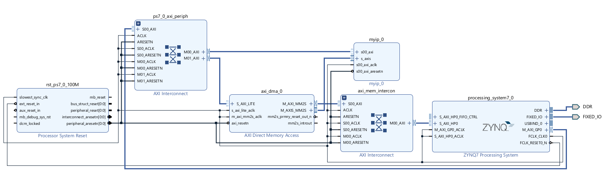
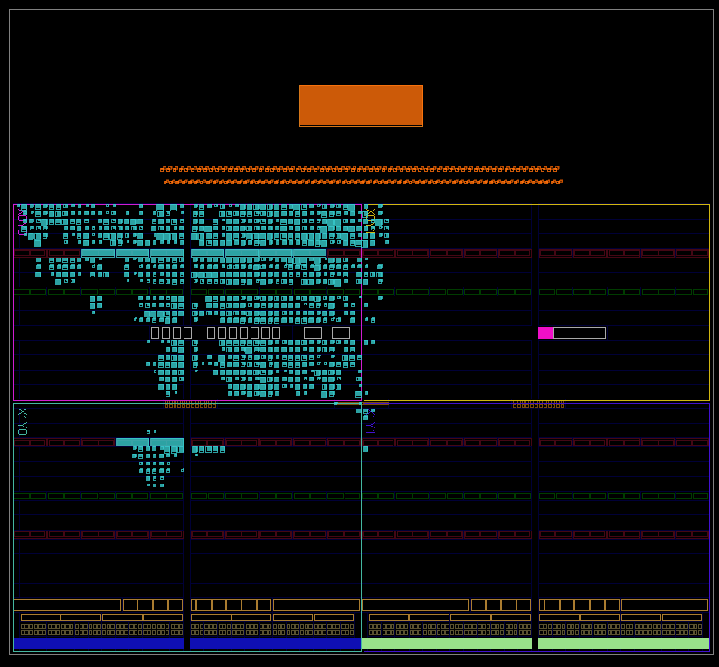

# FPGA FC-Layer Accelerator on Zynq: Diagnosing and Removing a Data-Movement Bottleneck

This repository documents my implementation of an FC-layer accelerator on a Zynq-7000 SoC. I first profiled the PIO-based system on a Zybo Z7-10. Operand loading accounted for about 98 percent of the time measured for data loading, accelerator computation, and result readback.

I then added an AXI DMA loading path and an AXI-Stream-to-BRAM receiver. I kept the original PIO path for comparison. In a same-bitstream benchmark, the DMA path made operand loading 21.8 times faster.

Within the measured benchmark, the DMA-based accelerator ran 4.1 times faster than the -O2 Cortex-A9 software reference. The existing CHECK routine reported bit-exact agreement for all four output accumulators.

Project Contributions
---
| Contribution | Location |
|---|---|
| AXI-Stream → BRAM receiver | `rtl/axis_to_bram.v` |
| Runtime selectable PIO/DMA path and control fields | `docs/MODIFICATIONS.md` |
| DMA transfer control, cache handling, and status polling | `sw/dma_extension.c` |
| AXI DMA and Zynq HP0 integration | `docs/architecture.md` |
| On-board profiling, PIO/DMA measurements, and output checks | `results/` |
| DMA transfer length debugging | `docs/debugging_story.md` |

---

## Performance Measurements

The PIO path loads two 4,096-word operand arrays into on-chip BRAM. The processor sends each word through AXI4-Lite, resulting in 8,192 individual writes. Each write requires address, data, and response handshakes. The processor remains involved throughout the loading process.

The measurements below were collected on the Zybo Z7-10. The PL clock was 100 MHz. The Cortex-A9 ran bare-metal software compiled with -O2. The PIO and DMA paths were measured on the same DMA-enabled bitstream.:

| Stage | PIO path | DMA path |
|---|---|---|
| BRAM0 load | 923.22 µs | **42.43 µs** |
| BRAM1 load | 922.83 µs | **42.42 µs** |
| Core compute | 41.67 µs | 41.69 µs |
| Result readback | 0.83 µs | 0.83 µs |
| **End-to-end** | **1,888.54 µs** | **127.37 µs** |

Key Comparisons:
- The -O2 software reference took 519.26 µs. The PL compute stage was about 12.5 times faster.
- The PIO path took 3.6 times as long as the software reference. The DMA path was 4.1 times faster than the reference.
- A 4,096-word DMA load took 42.43 µs. The ideal transfer time at 100 MHz was 40.96 µs. The measured time was 3.6 percent higher than the ideal value.
- In the captured runs, the existing CHECK routine reported bit-exact agreement for all four output accumulators.

The board logs for these measurements are available in `results/`.

## DMA Data Path

````
PIO path: DDR -> CPU-driven AXI4-Lite writes -> BRAM -> four MAC cores
DMA path: DDR -> AXI DMA through HP0 -> AXI-Stream -> axis_to_bram -> BRAM -> four MAC cores
````

Control transactions remain on GP0. Bulk data moves from DDR through `S_AXI_HP0` and AXI DMA. The DMA's `M_AXIS_MM2S` output connects to the accelerator's `s_axis` input. The processor programs one MM2S transfer for each operand array.



Implementation details:

- I kept the PIO path and added a control register to select PIO or DMA at runtime. Register slot 10 at byte offset `0x28` contains the control fields. Bit 0 selects the loading path, and bit 1 selects the target BRAM. Keeping both paths allowed them to be measured on the same bitstream. The PIO path also provided a working reference during DMA integration.
- AXI-Stream provides data and valid/ready handshaking but does not provide a memory address. The `axis_to_bram` module increments the BRAM write address for each accepted word. It resets the address counter when it accepts `TLAST`. The receiver keeps `tready` high because BRAM can accept one write per clock. No additional backpressure logic is required in this design.
- The processor flushes both operand buffers with (`Xil_DCacheFlushRange`) after generating the inputs. This occurs before DMA begins because DMA reads DDR rather than the Cortex-A9 data cache.

## The Bug That Taught the Most

The first DMA bring-up hung with **no error flags**: status register `0x00000000` —
not halted, not idle, no DMA/slave/decode error. Instrumenting the transfer with
status-register polling and a timeout narrowed it to "the engine believes it has
nothing to do." The transfer size, 16,384 bytes, exceeds the **default 14-bit buffer
length register (max 16,383 bytes) by exactly one byte**, truncating the programmed
length to zero. Widening the length register to 23 bits resolved it; the next run
returned `SR = 0x1002` (Idle + IOC) and passed bit-exact verification.

Full trace and reasoning: `docs/debugging_story.md`.

## Known Limitations / Next Steps

- The baseline compute core does not robustly close timing at 100 MHz: an
  independent baseline rebuild reports WNS −0.905 ns, with the single-cycle
  multiply–accumulate path as the bottleneck. The benchmark implementation
  technically meets timing at WNS +0.020 ns, but its 20 ps setup margin is not
  robust. The architectural fix — pipelining the MAC and validating the added
  latency — has been identified but deliberately not applied. Full analysis:
  `results/timing_baseline.md`.
- Streaming directly to the cores (removing the BRAM staging entirely) is the
  natural next step; the DMA/cache/benchmark infrastructure built here carries over.

## Key Project Artifacts

| Artifact | Location |
|---|---|
| 21.8× loading / 4.1× end-to-end / bit-exact | `results/putty_dma_ab.log` (unedited capture) |
| Loading share (97.5% baseline session / 97.8% A/B session) | `results/putty_baseline_*.log`, `results/putty_dma_ab.log` |
| Timing analysis | `results/timing_baseline.md` + full Vivado reports |
| What is mine vs. course-provided | `docs/MODIFICATIONS.md` |

## Environment

Zybo Z7-10 (XC7Z010) · Vivado/Vitis 2022.2 · PL @ 100 MHz · Cortex-A9 bare-metal ·
SW optimization level recorded per measurement (`-O0` and `-O2` both reported in
`results/benchmark_summary.md`).

Implemented design on the XC7Z010 fabric (accelerator + DMA in cyan):


