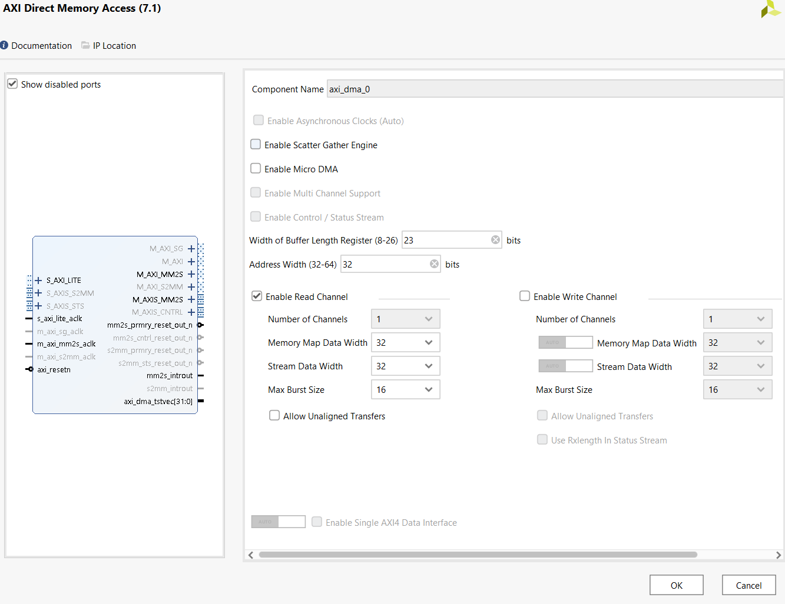

# Debugging a Silent DMA Failure

The most instructive failure in this project: the first DMA bring-up hung with
**no error indication anywhere**. This document records the actual diagnostic
path, with the real status-register values from the board.

## Symptom

Selecting the new DMA benchmark case froze the application before any output.
A subsequent CHECK was also unresponsive — consistent with the CPU being stuck
inside the DMA case, not with two independent failures. The original PIO path
on the same bitstream still worked, which immediately ruled out bitstream-,
clock/reset-, and address-map-level causes and localized the fault to the DMA
path itself.

## Instrumentation

The transfer routine was rebuilt as a diagnostic version: read and print the
MM2S status register (SR) on entry, after kicking the transfer, and inside a
polling loop with a timeout (so a hang becomes a printable state instead of a
freeze). Observed on the board:

```
DMA: enter,  SR=0x00000001    <- Halted (engine not yet started: expected)
DMA: kicked, SR=0x00000000    <- running... and it stays here forever
```

## Reading the state

`SR=0x00000000` is the interesting value — it rules things *out*:

- If the engine were broken or misaddressed → an **error bit** (DMAIntErr,
  DMASlvErr, DMADecErr) would set. None did.
- If it were genuinely transferring → **Idle** would eventually set. It never
  did.
- Neither halted, nor idle, nor faulted: the engine is running and believes it
  has **nothing to transfer**. The one programming input that produces that
  state is a **length of zero**.

## Root cause

We program the length as `MEM_DEPTH * 4 = 4096 * 4 = 16,384` bytes.

The AXI DMA's *Width of Buffer Length Register* defaults to **14 bits**,
capping a single transfer at **16,383 bytes**. Our size exceeds the cap by
**exactly one byte**; the write truncates to 0. Confirmed in the generated
hardware header:

```
#define XPAR_AXI_DMA_0_SG_LENGTH_WIDTH 14
```

A zero-length transfer is not an error condition — the engine simply has no
work — which is why every error flag stayed low.

## Fix and verification

Set the length-register width to 23 bits in the DMA IP configuration
(max 8 MB), regenerated the bitstream. No software change needed.



The same dialog shows the rest of the DMA configuration described in
`MODIFICATIONS.md`: Scatter-Gather disabled, read (MM2S) channel only.
Next run:

```
DMA: done, SR=0x00001002      <- Idle + IOC: transfer complete
```

followed by a bit-exact match against the software golden reference, and load
time of 42.4 µs — consistent with theory (4,096 words x 10 ns/clk ≈ 41 µs,
i.e., one word per clock with no dead cycles).

## Secondary lesson: instrumentation cost

The diagnostic printf calls inside the timed region inflated the measured load
time to ~1,400–7,000 µs (UART at 115,200 baud dominates). Removing them
revealed the true ~42.4 µs. Measurement code can perturb the measurement.
