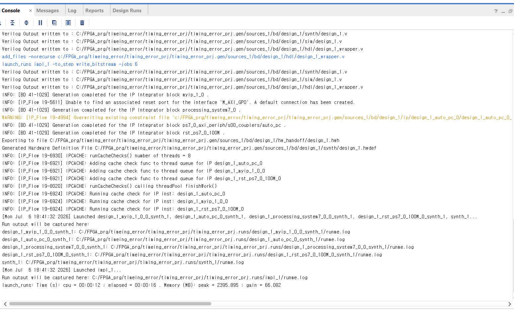
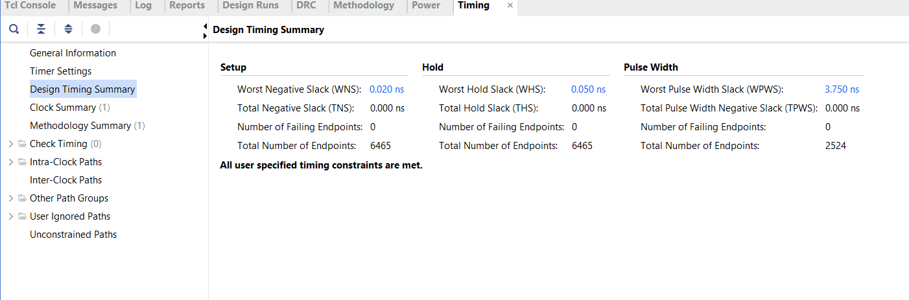
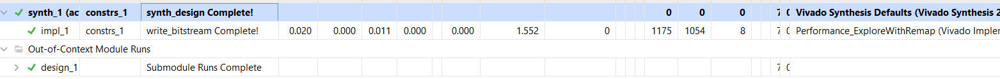

# Timing Analysis at 100 MHz (Baseline — Known Limitation)

Diagnosis of the baseline design's timing violation. Documented as-is: the fix
has been identified but **not yet applied**.

## 1. Measured status (failing)

Source: `report_timing_summary` / `report_timing` on the implemented design.
Raw reports in this folder: `timing_summary_baseline.rpt` (full summary with
the 10 worst paths), `utilization_baseline.rpt`.

**Reproducibility**: the violation was re-derived in an independent rebuild of
the baseline IP in a fresh project (July 2026, same sources, Vivado 2022.2)
and reproduced exactly — WNS −0.905 ns, TNS −20.753 ns, 51 failing endpoints:

| Metric | Value |
|---|---|
| Target clock | 100 MHz (10 ns, clk_fpga_0) |
| WNS | **−0.905 ns** (setup, failing) |
| TNS | −20.753 ns |
| Failing endpoints | 51 — all four cores' accumulate registers (`r_result_reg`) |
| WHS / THS | +0.051 ns / 0.000 ns (hold clean) |
| DSP48 usage | 0 / 80 (multiplies in LUT + CARRY4, 13 logic levels) |

## 2. Diagnosis (my analysis)

Worst path: BRAM data output → 8-bit multiply → 32-bit accumulate →
`r_result` register — the entire chain in one clock cycle (~10.6 ns against
~9.7 ns available). All 51 failing endpoints share this single root cause;
this is not scattered congestion but one architectural decision (single-cycle
MAC) exceeding the clock budget, aggravated by the multiplies being inferred
into LUT/carry logic instead of the device's DSP48 slices (0 of 80 used).

Worst path from `timing_summary_baseline.rpt`: `u_bram0/ram_reg_3` (RAMB36E1
read, 2.454 ns clock-to-out) → multiply/accumulate carry network → core 0
`r_result_reg[29]/D`. Data-path delay **10.628 ns** against a 10 ns budget;
**13 logic levels (8x CARRY4, 3x LUT6, 2x LUT4)**. All ten worst paths in the
report terminate at `r_result_reg` bits across the four core instances, and
`utilization_baseline.rpt` confirms **DSPs: 0 used / 80 available** — the
multiplies are absorbed into the LUT/carry fabric, which is exactly why the
chain does not fit in one cycle.

The DMA extension does not touch this path: it muxes the BRAM *write* port
(port 1), while the critical path runs from the BRAM *read* port (port 0)
through the MAC. Loading-time improvements and this violation are independent.

## 3. Identified fix (not yet applied)

- Pipeline the MAC: register the product before accumulation
  (latency +1 cycle; throughput unchanged at 1 MAC/cycle).
- Map the multiplies onto DSP48 slices for additional margin.

Applying and verifying this fix on the board (the +1-cycle latency must not
desynchronize the data mover's valid/done accounting) is the next step.

The course materials themselves include a revised core (`timing_rev.v`) that
applies exactly this fix — independent confirmation that the violation is real
and that pipelining is the accepted answer. I have deliberately not integrated
that revision: applying a fix I did not design would blur the authorship
boundary this repository documents.

## 4. Note: a marginal pass that was not claimed

An unrelated rebuild (IP repackaging; MAC path unchanged, verified against
source) closed at WNS +0.020 ns. Since no design change touched the failing
path, that pass is attributed to place-and-route variance at a borderline
constraint and deliberately **not** claimed as an improvement.

This is the implementation the benchmarks in this repository ran on, so its
timing summary is reproducible from the current project:

+0.020 ns of slack on a 10 ns clock is 0.2% margin — a coin flip of the
placer, not closure. The architectural fix in section 3 remains the real
answer.

## 4.5 Tool-level closure (deliberate, reproducible)

Re-implementing the baseline rebuild of section 1 — the same synthesized netlist that fails above — with the Performance_ExploreWithRemap implementation strategy (synthesis untouched, Vivado Synthesis Defaults) closes timing: WNS +0.020 ns, TNS 0, zero failing endpoints (timing_summary_explore.rpt, timing_paths_explore.rpt).

Unlike the marginal pass in section 4, this is intentional and repeatable. But the path report shows what it is not: logic levels are unchanged (13–14) and logic delay still consumes 6.2 ns of the 10 ns budget — the gain came from placement and routing, not from the datapath. A strategy meets timing; only the architectural fix in section 3 would create margin. That the two runs in sections 4 and 4.5 land at nearly identical slack (+0.020 ns) is tool behavior, not a shared cause: the router stops optimizing once timing is met, so borderline designs cluster just above zero.

## 5. Practical note

Functionally, all benchmarks in this repository pass bit-exact verification on
the board — the violated path has ~0.9 ns of negative slack against worst-case
corner models, and the silicon at room temperature meets it in practice. That
is not a substitute for closure; it is why the limitation is documented rather
than hidden.
